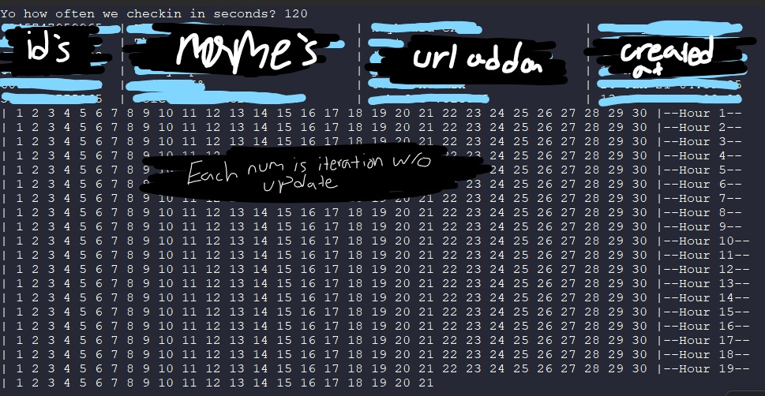

# Shopify Link Checker
This is an application I made just for fun but mainly to take away the stress of spamming F5 during FCFS drops.

## This will not automatically purchase an item for you
This is able to bring you to the checkout page with the item in your cart but that's about it.

## What is variant product name
Quite simply some FCFS shopify websites will try to put up fake products behind the scenes with the name of the product you want,  
this makes it annoying when searching for the title sometimes so to combat that I use a variant name instead. If you were to want  
a pair of shoes they'll behind the scenes have a title and variants for different options to select for it. The variant option you  
want is what I am searching for as shopify doesn't use the title of the item's id to put in your cart but instead the variant id.

### About
I created this after finding out some shopify websites are very poorly put together and leave endpoints exposed for the user.  
With that said this application doesn't support all shopify websites and if you are having issues that is why.
